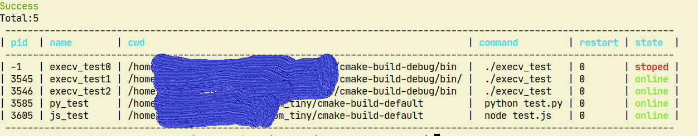

## pm_tiny进程管理工具

pm_tiny(process manager tiny)是Linux环境下进程管理工具。在进程异常退出时能够重新启动应用程序，保障服务的可用性。
pm_tiny同时会将应用程序的输出内容重定向到日志文件中，日志文件实现循环覆盖，确保不会因为输出日志太多消耗完存储空间。

### 编译

代码使用c++实现(编译器需支持C++14)，除标准库外无其他依赖。

项目使用cmake构建，请确保系统已安装cmake。

**Linux通用平台编译**

```shell
$ mkdir build && cd build
$ cmake ..
$ make
```

**Hi3559A V100 平台编译**

已安装相应的SDK,交叉编译工具链应该位于目录`/opt/hisi-linux/x86-arm`
```shell
$ mkdir hisi_build && cd hisi_build
$ cmake -DCMAKE_TOOLCHAIN_FILE=../toolchains/himix100.toolchain.cmake ..
$ make
```
### 使用

拷贝编译产物`build/pm_tiny`,`build/pm`到环境变量路径 ，运行pm_tiny服务(正式环境中应配置pm_tiny为开机自启动)：
```shell
$ pm_tiny -d #-d参数指定以daemon方式运行
```

就将程序交给pm_tiny管理:

1、添加程序

```shell
$ pm start "node test.js arg0 arg1" --name app_name #运行app.js并取名为app_name,名称用于后面管理使用，不能重复
Success
Total:1
 ------------------------------------------------------------------------------------------
| pid   | name     | cwd                      | command                 | restart | state  |
 ------------------------------------------------------------------------------------------
| 21864 | app_name | /home/xx/pm_tiny/default |  node test.js arg0 arg1 | 0       | online |
 ------------------------------------------------------------------------------------------

```

2、查看程序

```shell
$ pm ls 
Total:1
 ------------------------------------------------------------------------------------------
| pid   | name     | cwd                      | command                 | restart | state  |
 ------------------------------------------------------------------------------------------
| 21864 | app_name | /home/xx/pm_tiny/default |  node test.js arg0 arg1 | 0       | online |
 ------------------------------------------------------------------------------------------

```

3、停止程序

```shell
$ pm stop app_name
Success
Total:1
 ----------------------------------------------------------------------------------------
| pid | name     | cwd                      | command                 | restart | state  |
 ----------------------------------------------------------------------------------------
| -1  | app_name | /home/xx/pm_tiny/default |  node test.js arg0 arg1 | 0       | stoped |
 ----------------------------------------------------------------------------------------

```

4、运行程序

```shell
$ pm start app_name
Success
Total:1
 ------------------------------------------------------------------------------------------
| pid   | name     | cwd                      | command                 | restart | state  |
 ------------------------------------------------------------------------------------------
| 22047 | app_name | /home/xx/pm_tiny/default |  node test.js arg0 arg1 | 0       | online |
 ------------------------------------------------------------------------------------------

```

5、删除程序

```shell
$ pm delete app_name
Success
Total:0
 ----------------------------------------------
| pid | name | cwd | command | restart | state |
 ----------------------------------------------
```

6、持久化启动配置，pm_tiny服务启动后运行在配置中的程序(配置默认保存在`~/.pm_tiny/prog.cfg`文件中)

```shell
$ pm save
Success
```

应用程序的输出日志默认在`~/.pm_tiny/logs`目录下

