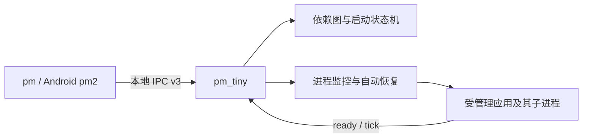

<picture>
  <source media="(prefers-color-scheme: dark)" srcset="images/pm-tiny-logo-dark.svg">
  
</picture>

# PM_Tiny

简体中文 | [English](README_en.md)

PM_Tiny 是面向嵌入式设备与边缘节点的轻量级跨平台进程监督器，用于可靠地启动、监控、停止和恢复一组存在依赖关系的本地应用。

它由守护进程 `pm_tiny` 和命令行客户端组成：Linux/Windows 使用 `pm`，Android 使用 `pm2`，避免与系统自带的 `/system/bin/pm` 包管理器冲突。

## 核心能力

- **依赖编排**：校验 DAG，按稳定拓扑顺序启动，依赖失败时标记下游为 `blocked`，恢复后自动继续。
- **自动恢复**：支持异常重启、指数退避、时间窗口限流、ready/tick 心跳及启动/心跳超时。
- **完整进程树终止**：Linux/Android 使用 cgroup v2 并可降级到进程组；Windows 使用 Job Object。
- **本地安全通信**：Linux/Android 使用 Unix Domain Socket，Windows 使用 named pipe，均承载二进制协议 v3。
- **可观测 CLI**：提供自适应列表、JSON 状态、依赖图、进程详情、日志流和明确的连接错误诊断。
- **离线可部署**：C++14/CMake 工程，第三方依赖随源码固定，可用于无外网的设备构建环境。

## 架构


```mermaid
flowchart LR
    CLI[pm / Android pm2] -->|本地 IPC v3| Daemon[pm_tiny]
    Daemon --> DAG[依赖图与启动状态机]
    Daemon --> Runtime[进程监控与自动恢复]
    Runtime --> Apps[受管理应用及其子进程]
    Apps -->|ready / tick| Daemon
```

`pm_tiny` 持有配置、依赖图和运行状态；CLI 只通过本机 IPC 查询状态或发送控制命令。核心不开放 HTTP 端口，也不承担容器编排或完整 init 职责。

## 快速体验（Linux）

```bash
git clone <repository-url> pm_tiny
cd pm_tiny

cmake -S . -B build -DCMAKE_BUILD_TYPE=Release
cmake --build build --target pm_tiny pm

./build/pm_tiny &
./build/pm start demo --no-daemon --no-pty -- /usr/bin/sleep 300
./build/pm list
./build/pm graph
./build/pm stop demo
./build/pm delete demo
./build/pm quit
```

默认运行目录为 `~/.pm_tiny`，进程配置为 `~/.pm_tiny/prog.yaml`。生产环境可执行 `sudo make install_ubuntu` 安装 systemd 服务。

## 平台支持

| 平台 | 状态 | CLI | 进程树后端 | 构建/部署入口 |
| --- | --- | --- | --- | --- |
| Linux | 稳定 | `pm` | cgroup v2 / process group | `make build` 或 CMake |
| Android | 支持 | `pm2` | cgroup v2 / process group | Android NDK CMake；安装产物为 `bin/pm2` |
| Windows | 开发中但可用 | `pm.exe` | Job Object | VS 2022 MSVC；参见 [Windows 状态](docs/windows_port_status.md) |
| Hi3559A / AX620A | 交叉编译支持 | `pm` | 平台 Linux 能力 | [`toolchains/`](toolchains) |

Android 的 CMake target 仍名为 `pm`，因此使用 `cmake --build <dir> --target pm` 构建，但生成和安装的设备端文件名为 `pm2`。这里的名称仅用于避开 Android 系统命令，与 Node.js 的 PM2 项目无关。
Android 构建固定静态链接 libc++，产物不依赖 `libc++_shared.so`。

## 常用命令

| 命令 | 说明 |
| --- | --- |
| `pm list [--wide\|--json] [--no-color]` | 查看运行状态；Android 将 `pm` 替换为 `pm2`。 |
| `pm graph [name] [--json\|--dot]` | 查看完整依赖图或指定节点的上下游子图。 |
| `pm start <name> [--log]` | 启动已有定义。 |
| `pm start <name> [options] -- <executable> [args...]` | 三平台动态增加并启动运行时定义。 |
| `pm start <name>` | 启动已配置进程及其依赖闭包。 |
| `pm stop\|restart\|delete <name>` | 停止、重启或删除进程。 |
| `pm log <name> [--history]` / `pm inspect <name>` | 跟随运行中进程日志，或查看已停止进程最后一代缓存；检查配置与运行信息。 |
| `pm info [--json]` | 查看 daemon 生效配置及来源、运行模式、平台能力和健康状态。 |
| `pm save` / `pm reload` | 持久化当前配置或重新加载配置文件。 |
| `pm quit` / `pm version` | 退出守护进程或查看版本。 |

完整参数以 `pm --help`（Android 为 `pm2 --help`）为准。`list --json`、`graph --json` 和
`info --json` 提供适合自动化脚本使用的稳定结构化输出。

Linux/Android 需要以其他用户运行动态命令时，应让 root `pm_tiny` 直接切换身份，例如
`pm start task --user root -- /usr/local/bin/task`，不要依赖交互式 `sudo`。省略 `--user` 时 daemon
根据 CLI 连接的真实 UID 运行；跨用户启动要求 executable 带路径，并清理继承的 PATH、`SUDO_*` 和
`LD_*`，需要的变量应通过 `--env` 明确设置。daemon 的 UID/GID allowlist 具有完整管理权限。

## 最小依赖配置

```yaml
- name: database
  cwd: /opt/app
  executable: ./database
  daemon: true
  pty: false

- name: api
  cwd: /opt/app
  executable: ./api
  daemon: true
  pty: false
  depends_on: [database]
  start_timeout: 10
  failure_action: restart
```

`database` ready 后才会启动 `api`。配置加载、动态增加和 reload 都会拒绝缺失依赖、自依赖、重复依赖及环。更多字段参见 [`examples/config/linux/prog.yaml`](examples/config/linux/prog.yaml)。

每程序日志默认使用 `split` 模式，生成 `<name>_stdout.log` 和 `<name>_stderr.log`；可用 `log_mode: combined` 合并为 `<name>.log`。Linux/Android 与 Windows 共用 `log_dir`、`log_file_name`、`log_max_size_kb`、`log_archive_count` 字段及 `.1` 最新历史文件的轮转规则。写盘失败不会停止业务进程，`pm list --json` 和 `pm inspect` 会显示降级、丢失字节、重试时间和有效路径。旧 Windows 日志别名不再支持。

三平台 daemon 配置文件均命名为 `pm_tiny.yaml`，并通过 `pm_tiny_prog_cfg_file` 指向
`prog.yaml`。daemon 日志使用 `pm_tiny_log_file`、`pm_tiny_app_log_dir`、
`pm_tiny_app_environ_dir`、`pm_tiny_log_level`、`pm_tiny_log_max_size_kb` 和
`pm_tiny_log_archive_count`；优先级为 CLI、环境变量、配置文件、内置默认值。Windows 已支持
`PM_TINY_HOME`，前台默认 `%USERPROFILE%\.pm_tiny`，SCM 默认 `%ProgramData%\pm_tiny`。详细规则见
[`docs/daemon_configuration.md`](docs/daemon_configuration.md)。Windows 正式构建验证仅使用 VS 2022/MSVC x64。

## 构建与验证

```bash
cmake -S . -B build -DCMAKE_BUILD_TYPE=Release -DPM_TINY_BUILD_TESTS=ON
cmake --build build
cmake -E chdir build ctest --output-on-failure
cmake --install build
```

- Ubuntu systemd：`sudo make install_ubuntu`
- Windows SCM：[`scripts/windows/`](scripts/windows)
- Android 实机回归：[`scripts/test_android_process_tree.sh`](scripts/test_android_process_tree.sh)、[`scripts/test_android_restart_policy.sh`](scripts/test_android_restart_policy.sh)、[`scripts/test_android_dependency_graph.sh`](scripts/test_android_dependency_graph.sh)

## 文档

- [依赖图和启动状态机](docs/dependency_graph.md)
- [进程树终止与 Android 约束](docs/process_tree_termination.md)
- [IPC 协议 v3](docs/protocol_v3.md)
- [Daemon 参数、环境变量与目录](docs/daemon_configuration.md)
- [Windows 移植状态与限制](docs/windows_port_status.md)
- [项目目录结构与测试约定](docs/project_structure.md)
- [测试平台：真实 cgroup/PTY、coverage、fuzz 与升级回滚](docs/testing_platform.md)
- [项目定位、竞品分析与路线图](docs/project_roadmap.md)
- [基准与同类项目对比](docs/benchmark.md)
- [变更记录](CHANGELOG.md)
- [贡献指南](CONTRIBUTING.md)
- [安全策略](SECURITY.md)

PM_Tiny 保持本地控制、低资源占用和离线部署，不计划替代 systemd/Android init/Windows SCM，也不在核心 daemon 中内置 Web UI、云管理或容器编排能力。

## 许可证

PM_Tiny 采用 [Apache License 2.0](LICENSE) 发布。仓库内第三方依赖继续适用各自的许可证。
