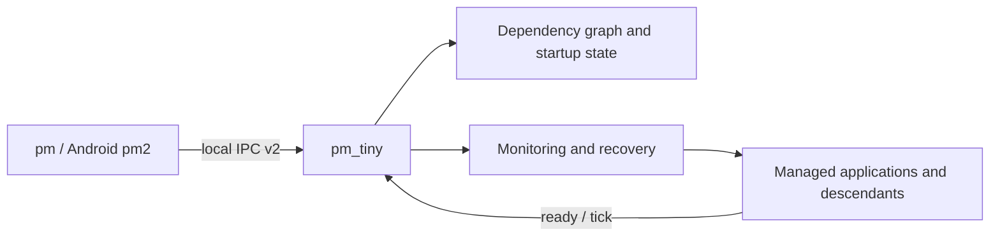

<picture>
  <source media="(prefers-color-scheme: dark)" srcset="images/pm-tiny-logo-dark.svg">
  
</picture>

# PM_Tiny

[简体中文](README.md) | English

PM_Tiny is a lightweight cross-platform process supervisor for embedded devices and edge nodes. It reliably starts, monitors, stops, and recovers a set of local applications with dependency relationships.

It consists of the `pm_tiny` daemon and a command-line client: Linux and Windows use `pm`, while Android uses `pm2` to avoid conflicting with the platform's `/system/bin/pm` package manager.

## Core Capabilities

- **Dependency orchestration**: Validate DAGs, start in stable topological order, block downstream nodes after dependency failures, and resume them after recovery.
- **Automatic recovery**: Crash restart, exponential backoff, bounded restart windows, ready/tick heartbeats, and startup/heartbeat timeouts.
- **Whole process-tree termination**: Linux/Android use cgroup v2 with process-group fallback; Windows uses Job Objects.
- **Local IPC**: Linux/Android use Unix Domain Sockets and Windows uses named pipes, all carrying binary protocol v2.
- **Observable CLI**: Adaptive tables, JSON status, dependency graphs, inspection, log streaming, and actionable connection diagnostics.
- **Offline deployment**: A C++14/CMake project with pinned bundled dependencies for disconnected device build environments.

## Architecture



`pm_tiny` owns configuration, dependency state, and runtime state. The CLI only queries or controls it through local IPC. The core opens no HTTP port and does not act as a container orchestrator or full init system.

## Quick Start (Linux)

```bash
git clone <repository-url> pm_tiny
cd pm_tiny

cmake -S . -B build -DCMAKE_BUILD_TYPE=Release
cmake --build build --target pm_tiny pm

./build/pm_tiny &
./build/pm start "/usr/bin/sleep 300" --name demo --no_daemon --no_pty
./build/pm list
./build/pm graph
./build/pm stop demo
./build/pm delete demo
./build/pm quit
```

The default runtime directory is `~/.pm_tiny`, with process definitions in `~/.pm_tiny/prog.yaml`. On production Ubuntu hosts, run `sudo make install_ubuntu` to install the systemd service.

## Platform Support

| Platform | Status | CLI | Process-tree backend | Build/deployment entry |
| --- | --- | --- | --- | --- |
| Linux | Stable | `pm` | cgroup v2 / process group | `make build` or CMake |
| Android | Supported | `pm2` | cgroup v2 / process group | Android NDK CMake; installed as `bin/pm2` |
| Windows | Usable, still evolving | `pm.exe` | Job Object | VS 2022 MSVC; see [Windows status](docs/windows_port_status.md) |
| Hi3559A / AX620A | Cross-build support | `pm` | Platform Linux capabilities | [`toolchains/`](toolchains) |

The Android CMake target remains named `pm`, so build it with `cmake --build <dir> --target pm`; the generated and installed device binary is `pm2`. This name only avoids the Android system command and is unrelated to the Node.js PM2 project.

## Command Reference

| Command | Description |
| --- | --- |
| `pm list [--wide\|--json] [--no-color]` | Show runtime status; replace `pm` with `pm2` on Android. |
| `pm graph [name] [--json\|--dot]` | Show the full DAG or a focused upstream/downstream subgraph. |
| `pm start <command> --name <name> [options]` | Dynamically add and start a process on Linux/Android. |
| `pm start <name>` | Start a configured process and its dependency closure. |
| `pm stop\|restart\|delete <name>` | Stop, restart, or remove a process. |
| `pm log\|inspect <name>` | Stream logs or inspect configuration and runtime details. |
| `pm save` / `pm reload` | Persist current definitions or reload the configuration file. |
| `pm quit` / `pm version` | Stop the daemon or show its version. |

Use `pm --help` (`pm2 --help` on Android) for all options. `list --json` and `graph --json` provide stable structured output for automation.

## Minimal Dependency Configuration

```yaml
- name: database
  cwd: /opt/app
  command: ./database
  daemon: true
  pty: false

- name: api
  cwd: /opt/app
  command: ./api
  daemon: true
  pty: false
  depends_on: [database]
  start_timeout: 10
  failure_action: restart
```

`api` starts only after `database` becomes ready. Configuration load, dynamic addition, and reload reject missing, self, duplicate, and cyclic dependencies. See [`script/prog.yaml`](script/prog.yaml) for more fields.

## Build and Test

```bash
cmake -S . -B build -DCMAKE_BUILD_TYPE=Release -DPM_TINY_BUILD_TESTS=ON
cmake --build build
ctest --test-dir build --output-on-failure
cmake --install build
```

- Ubuntu systemd: `sudo make install_ubuntu`
- Windows SCM: [`scripts/windows/`](scripts/windows)
- Android device regression: [`scripts/test_android_process_tree.sh`](scripts/test_android_process_tree.sh), [`scripts/test_android_restart_policy.sh`](scripts/test_android_restart_policy.sh), [`scripts/test_android_dependency_graph.sh`](scripts/test_android_dependency_graph.sh)

## Documentation

- [Dependency graph and startup state](docs/dependency_graph.md)
- [Process-tree termination and Android constraints](docs/process_tree_termination.md)
- [IPC protocol v2](docs/protocol_v2.md)
- [Windows port status and limitations](docs/windows_port_status.md)
- [Project direction, comparisons, and roadmap](docs/project_roadmap.md)

PM_Tiny remains local-first, low-overhead, and offline deployable. It does not aim to replace systemd, Android init, or Windows SCM, and the core daemon will not embed a Web UI, cloud management plane, or container orchestration layer.
