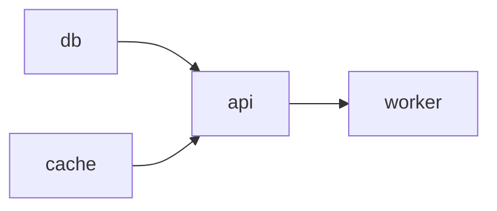

# 进程依赖图

PM_Tiny 将 `depends_on` 解释为启动依赖。边的方向为“依赖程序 -> 被依赖程序”，例如
`api depends_on: [db]` 对应 `db -> api`。Linux、Android 和 Windows 使用同一套依赖图校验、
稳定拓扑排序和启动状态机。



## 校验与顺序

配置加载、reload 和动态新增都会拒绝空名称、重复名称、重复依赖、自依赖、缺失依赖和环。
环错误会包含可定位的路径。多个节点同时可启动时，按配置文件中的原始顺序稳定选择；停止和
reload 使用逆拓扑顺序。

## 启动状态

- `waiting`：已请求启动，但依赖尚未全部 ready。
- `starting`：进程已创建，正在等待立即就绪、启动超时或 SDK `ready`。
- `online`：依赖条件已满足，可解锁下游。
- `failed`：该程序自身启动失败或启动阶段终止。
- `blocked`：该程序尚未启动，且至少一个依赖处于 failed/blocked。

一个节点只有在全部直接依赖 online 后才会启动。diamond 图中的汇合节点只启动一次。失败只向
尚未启动的传递下游传播，独立旁支继续运行。失败依赖通过手动 start/restart 恢复并再次 ready 后，
所有阻塞原因都消失的下游会自动继续启动。

`pm list` 和 `pm list --json` 会直接显示 `failed`/`blocked`。Windows `pm inspect` 还输出
`dependency_state` 和 `blocked_by`；Linux/Android 的具体启动错误与依赖校验路径记录在 daemon 日志中。

## 查看依赖图

`pm graph`（别名 `pm dag`；Android 设备端命令为 `pm2 graph` / `pm2 dag`）复用进程列表快照，在客户端按稳定拓扑层显示名称、状态、依赖和
最终失败根因。`pm graph <name>` 只显示该节点、全部传递依赖及全部传递依赖者；如果可见节点
还依赖视图外节点，会标记为 `external`，不会误画成内部边。

```bash
pm graph --no-color
pm graph api --json
pm graph --dot > pm_tiny.dot
```

JSON 输出的 `schema_version` 为 1，包含 `focus`、`nodes` 和 `edges`；边方向仍为依赖到被依赖者。
DOT 使用 `rankdir=LR`，只生成文本，不要求运行 pm 的设备安装 Graphviz。该功能不增加协议命令，
支持进程列表 schema v3 的 daemon 均可直接使用。

Android 实机回归可执行 `./scripts/test_android_dependency_graph.sh <adb-serial>`；脚本读取安装目录中的
`bin/pm2`，并使用独立目录和
抽象 socket，不会停止或替换设备上已有的生产 pm_tiny，并会校验其 PID 在测试前后仍然存在。

## 运行时操作

- `pm start <name>` 自动请求目标及其未满足的依赖闭包。
- 删除仍有直接依赖者的程序会被拒绝，并返回依赖者名称。
- 删除叶节点后重新构建依赖图，不会静默修改其他程序的 `depends_on`。
- reload 先完整校验新图，成功后再替换旧配置；当前仍为全量停止和重启。
- 依赖在下游已经 online 后退出时，不会级联停止该下游；该行为保留现有兼容语义。

依赖图只保存名称和边，不持有平台进程对象。启动进度保存在独立 runtime 中，因此图可持续用于
诊断、逆序停止和后续 reload 差异分析。
